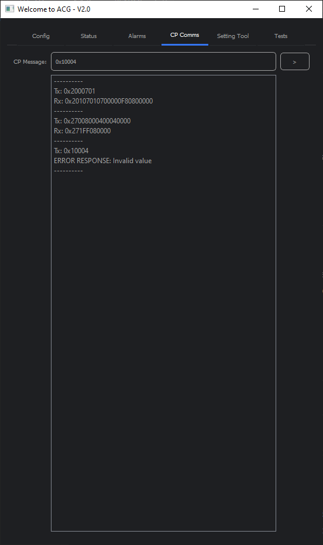

# Python Actuator Configuration User Interface
*Author: Kieran Gash (kieran.gash@rotork.com)*

*v2.0.0*

NOTE: SOURCE CODE HAS BEEN REMOVED BUT IMAGES ARE STILL PRESENT TO DEMONSTRATE USUABILITY OF THE APPLICATION

This project provides an easy-to-use graphical user interface to enable interaction with Rotork products which utilise
CP (Common Protocol) over Bluetooth and/or CAN-bus communications. This project makes use of the Rotork Common Protocol
Python Package. 

## Features
- Bluetooth communications
- CAN-bus communications
- CP Chat emulation (currently supporting read index and write index)
- Setting Tool emulation to support UI menu navigation.
- Visual actuator status indicators.
- Visual actuator alarm indicators.
- Actuator Test Centre

## Application Screenshots

## Dependencies
***Hardware***
- PEAK PCAN-USB - https://www.peak-system.com/PCAN-USB.199.0.html?&L=1
- Bluetooth capable Test PC

***Software / Packages***
- rotork cp - http://code.rotork.net/TestAutomation/LibrariesAndDrivers/rotork_common_protocol_python_package
- PyQt5 - Python Gui creation package - https://doc.qt.io/qtforpython-5/contents.html

## Using CAN Communications
1. Ensure PCAN hardware is connected to the UUT and Test PC.
2. Ensure the PCAN hardware is not being used for any other activity as this can affect usability. 
3. Locate and start the application: (Enter folder structure here)
4. Click the PCAN "CONNECT" button on the "Setup" tab to connect to the device.
5. Click the PCAN "DISCONNECT" button on the "Setup" tab to disconnect from the device. 

## Using Bluetooth Communications
1. Ensure Bluetooth hardware is available (Built in or via dongle)
2. Ensure the Bluetooth hardware is not being used for any other activity as this can affect usability.
3. Ensure the target is not connected to another device using Bluetooth. 
4. Locate and start the application: (Enter folder structure here)
5. Enter the target MAC address following the form: AA:BB:CC:DD:EE:FF
6. Click the Bluetooth "CONNECT" button on the "Setup" tab to connect to the device. 
7. Click the Bluetooth "DISCONNECT" button on the "Setup" tab to disconnect from the device. 

## Entering Password
The password entry can only be used after a connection has been established with the target via CAN or BT.

The password entry options simplify and speed up the process of entering the varying Rotork standard passwords. If
required, the passwords can also be entered manually using the actuator UI. 

Only 1 password credential can be entered at any time. The button highlighted blue indicates which password is currently
applied to the target. 

1. Connect to the target via CAN or BT. 
2. Ensure the unit is in Local or Stop. 
3. Select the password entry levels required to apply the password. 
4. Reselect the same password entry level to remove the password credentials.
5. Select another password entry level. 
6. Place the target into Remote to clear the password credentials. 

## Getting Actuator Status
The Status' are not live. It is retrieved as and when the Update button is clicked. This will be improved in later 
revisions 

1. Connect to the target via CAN or BT. 
2. Click the "UPDATE STATUS" button on the "Status" tab.
3. Verify some of the LED widgets change state to reflect the actuator status. 
4. Change Local/Stop/Remote state. 
5. Click the "UPDATE STATUS" button on the "Status" tab.
6. Verify the LED referring to the Local/Stop/Remote status has been updated. 

## Getting Actuator Alarms
The Alarms are not live. It is retrieved as and when the Update button is clicked. This will be improved in later 
revisions 

1. Connect to the target via CAN or BT. 
2. Click the "UPDATE ALARMS" button on the "Alarms" tab.
3. Verify some of the LED widgets change state to reflect the actuator status. 
4. Set the Local/Stop/Remote knob to Remote
5. Click the "UPDATE ALARMS" button on the "Alarms" tab.
6. Verify the LED referring to the Monitor Relay is updated. 

## Performing CP Read and Write
The CP Comms tab is an emulation of the Insight 2 CP Chat tool however, it is currently limited to read index and write
index functions only.

The CP communications history will be saved in the list widget until the application is closed. 

***Message Structure***  
All CP messages must follow the form:`0x[OBJECT][FUNCTION][INDEX][LENGTH][DATA]`

***Example Read***  
Absolute Position: `0x2220700`

***Example Write***  
Option 1 - Profinet: `0x100080C020876`

***Error Responses***  
Text or Non-Hex values entered: `Invalid value`  
CAN or BT comms not connected or operating effectively: `Comms Error`  
Function is not read (0x07) or write (0x08): `CP function not supported`

## Functionality To Add
1. Add a live position and torque display on one of the tabs
2. Make the status and alarms update on a thread rather than button triggered
3. Improve application sizing based on screen resolution. 
4. Move tests into test folder away from helper functions
5. Increase support for CP functions within the CP Comms tab (read file etc...)
6. Add firmware upload functionality
7. Add Connected actuator information such as firmware versions and serial numbers

## Known Bugs
1. Currently not possible to disconnect and then reconnect the CAN communications. Upon disconnecting and then 
reconnecting, the application will crash
2. Bluetooth is also very flakey upon reconnection. 
3. PCAN RX Overrun can occasionally occur which will lock up the application. Need to manage this and purge the buffer
if this happens, or we get close so that the application remains operational. 
